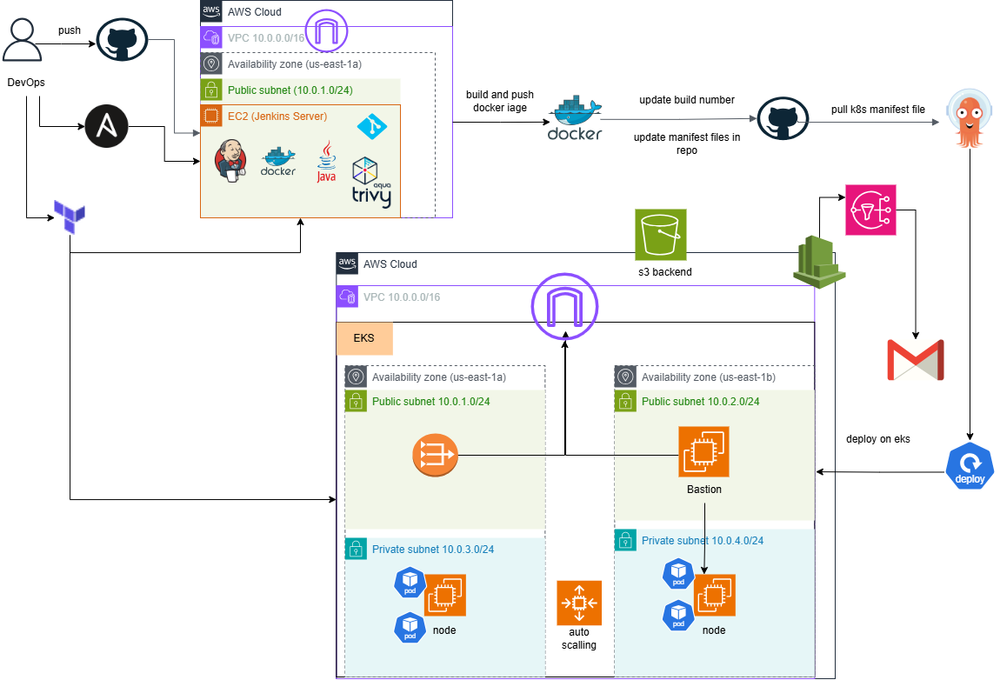

# 🚀 CloudDevOpsProject

Enterprise End-to-End DevOps Project implementing full CI/CD and GitOps workflow on AWS using Terraform, Ansible (with Vault), Jenkins, Kubernetes (EKS), and ArgoCD.

---

## 📌 Architecture Overview

This project represents a production-grade DevOps architecture where the entire lifecycle—from infrastructure provisioning to application deployment—is fully automated.

* Infrastructure is provisioned using Terraform (modular design).
* Jenkins server is configured automatically using Ansible.
* Sensitive Jenkins credentials are securely stored using **Ansible Vault**.
* Jenkins pipelines use a **Shared Library** for clean and reusable CI logic.
* Kubernetes manifests are managed using **GitOps**.
* ArgoCD is the single source of deployment truth and syncs changes automatically to EKS.

---

## 🔄 End-to-End Workflow

1. Terraform provisions AWS infrastructure (VPC, EC2, EKS, etc.).
2. Ansible configures the Jenkins EC2 server using dynamic inventory.
3. Jenkins credentials are injected securely via Ansible Vault.
4. Developer pushes code to GitHub.
5. Jenkins pipeline triggers automatically.
6. Docker image is built.
7. Image is scanned using Trivy.
8. Image is pushed to DockerHub.
9. Kubernetes deployment manifest image tag is updated.
10. Updated manifests are pushed to GitHub.
11. ArgoCD detects the change and syncs it automatically to the EKS cluster.
12. Application is deployed/updated in Kubernetes.

---

## 🛠 Technology Stack

* Cloud Provider: AWS
* Infrastructure as Code: Terraform
* Configuration Management: Ansible (with Vault)
* CI Tool: Jenkins (Shared Library)
* CD Tool: ArgoCD (GitOps)
* Containerization: Docker
* Orchestration: Kubernetes (EKS)
* Image Security Scanning: Trivy
* Monitoring: AWS CloudWatch
* Terraform Backend: S3

---
## 🖼 Architecture Diagram



---
## ☁ Infrastructure Provisioning (Terraform)

📁 Directory: `terraform/`

### Key Features

* Modular Terraform structure:

  * Network module (VPC, Subnets, IGW, NACL)
  * EC2 module (Jenkins Server)
  * EKS module
* Remote backend using S3
* CloudWatch monitoring enabled for EC2
* Security Groups and IAM roles configured

Terraform manages the full lifecycle of AWS resources.

---

## ⚙ Configuration Management (Ansible)

📁 Directory: `ansible/`

### Highlights

* Role-based Ansible structure
* Dynamic inventory using AWS EC2 plugin
* **Ansible Vault** used to store Jenkins credentials securely
* Fully automated Jenkins setup

### Installed Components

* Git
* Docker
* Java
* Jenkins
* Trivy

### Main Playbook

Roles executed in order:

* git
* docker
* java
* jenkins
* trivy
* jenkins_ci_setup

---

## 🐳 Containerization (Docker)

📁 Directory: `src/Dockerfile`

* Python Flask application
* Lightweight base image (`python:3.10-slim`)
* Dependencies installed via `requirements.txt`
* Application exposed on port 5000

---

## ☸ Kubernetes Orchestration

📁 Directory: `k8s/`

Contains:

* Namespace definition
* Deployment manifest
* Service manifest

⚠ Kubernetes manifests are **not applied manually** in normal operation.
They are deployed automatically by ArgoCD using GitOps.

---

## 🔁 Continuous Integration (Jenkins)

📁 Locations:

* `src/Jenkinsfile`
* `src/jenkins-shared-library/vars/`

### Pipeline Stages

* Build Docker Image
* Security Scan (Trivy)
* Push Image
* Remove Local Image
* Update Kubernetes Manifest (GitOps)

### Shared Library

Reusable Groovy functions abstract pipeline logic for cleaner Jenkinsfiles.

---

## 🚀 Continuous Deployment (ArgoCD)

📁 Directory: `argocd/`

* ArgoCD Application manifest stored in GitHub
* Auto-sync enabled
* Self-healing and pruning enabled
* Kubernetes namespace auto-created

ArgoCD is the **only component** responsible for applying Kubernetes manifests.

---

## 🔄 GitOps Model

* Jenkins updates Kubernetes manifests (image tag only).
* Changes are pushed to GitHub.
* ArgoCD watches the repository.
* ArgoCD syncs the desired state into EKS automatically.

Benefits:

* Versioned deployments
* Easy rollback via Git
* Full traceability

---

## 📁 Repository Structure
```bash
CloudDevOpsProject/
├── ansible/
├── terraform/
├── k8s/
├── argocd/
├── src/
└── README.md
```
---

## ▶ Execution Overview

High-level flow:

* Terraform provisions infrastructure.
* Ansible configures Jenkins.
* Jenkins runs CI pipeline on code push.
* ArgoCD deploys application automatically to EKS.

---


## ▶ How to Run the Project

Follow the steps below to run the full project from infrastructure provisioning to application deployment:

### 1️⃣ Provision Infrastructure (Terraform)

```bash
cd terraform
terraform init
terraform apply
```

This will provision:

* VPC and networking resources
* EC2 instance for Jenkins
* EKS cluster
* Required IAM roles and security groups

---

### 2️⃣ Configure Jenkins Server (Ansible)

After infrastructure is created, configure Jenkins automatically using Ansible with dynamic inventory and Vault:

```bash
cd ansible
ansible-playbook -i inventory/aws_ec2.yaml site.yaml --ask-vault-pass
```

This installs:

* Git
* Docker
* Java
* Jenkins
* Trivy

Jenkins credentials are securely injected using **Ansible Vault**.

---

### 3️⃣ Access Jenkins

* Open browser
* Navigate to: `http://<EC2-External-IP>:8080`
* Configure the pipeline job using the existing `Jenkinsfile`

Push code to GitHub → Jenkins pipeline runs automatically.

---

### 4️⃣ Connect Local Machine to EKS

After EKS is provisioned, update kubeconfig:

```bash
aws eks update-kubeconfig --name eks-cluster --region us-east-1
```

This connects your local kubectl to the EKS cluster.

---

### 5️⃣ Install and Access ArgoCD

After ArgoCD is installed in the cluster:

Get initial admin password:

```bash
kubectl get secret argocd-initial-admin-secret -n argocd -o jsonpath="{.data.password}" | base64 -d
```

Expose ArgoCD server (if needed):

```bash
kubectl edit svc argocd-server -n argocd
```

---

### 6️⃣ Deploy Application via ArgoCD (GitOps)

Apply ArgoCD Application manifest:

```bash
cd argocd/argocd-run/
kubectl apply -f argocd-app.yml
kubectl get svc -n app-namespace 
```

ArgoCD will:

* Monitor the GitHub repository
* Detect manifest changes
* Automatically sync to EKS
* Deploy/update the application
* Access app by the LoadBalancer service `External-IP`
---

## Demo Video - iVolve Project

[iVolve Project Demo](https://drive.google.com/file/d/1NNemjR5n22CHM4rblo7V2zxKYWYbQJ97/view?usp=drivesdk)

---
## Authors

- Mai Salama  
- Youssef Mansy  
- Mohamed Taha  

**DevOps & Cloud Engineers**
